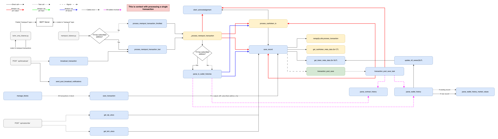

# Transaction Processing

Flow of how utxo (Transaction model), token metadata, Wallet history is made when a transaction is processed.

## Entrypoint
There are multiple ways to initiate the main flow for processing transactions.
### python manage.py mempool_listener.py
A django command that loops indefinitely and listens to mempool transactions that are published in a MQTT server. These MQTT messages published by `bchn_zmq_listener.py`. The actual function that initiate the flow is `_process_mempool_transaction` which is called in:
  - `process_mempool_transaction_fast` - If there is an address in the transaction that is subsribed to watchtower. 
  - `process_mempool_transaction_throttled` - If the condition above is not met.

### main.tasks.manage_blocks
A periodic task that scans through past blocks and processes every transaction with subscribed addresses in the output. Ignores coinbase transactions. The main function is `save_transaction`

### POST /api/subscription/
This api subscribes an address to watchtower. If the address is new, it's UTXOs are pulled from a node and saved into watchtower. The actual tasks that initiates the flow are `get_bch_utxos` and `get_slp_utxos` depending on the address type.

### POST /api/broadcast/

This api broadcasts a new transaction to the network. A test mempool accept is run first, if it is accepted, the transaction is broadcasted and processed immediately. The actual function that initiate the flow is `_process_mempool_transaction`


## Transaction processing flow



### Core steps
The core steps that are done during transaction processing are as follows:

1. **FLAG_SPENT** [Transaction Level]  - Flag inputs' **Transaction** instance as spent (update spending_tx)
2. **SAVE_TX_RECORD** [Input/Output Level] - Create **Transaction** instances for outputs (only subscribed ones).
    1. Should also include inputs of subscribed ones that don’t have **Transaction** instance (necessary for correct amount in wallet history)
3. **TOKEN_METADATA** [Input/Output level] - Get token metadata if has SLP or Cashtoken.
4. **SLP_NFT_UPDATE** [Input/Output level] Update SLP NFT owner record (see **WalletNftToken** model)
5. **EVENT_NOTIF** [Output level] Send webhooks, websockets, mqtt.
6. **WALLET_HISTORY_GEN** [Wallet Level] Create wallet history.
    1. Requires necessary inputs to be saved(**SAVE_TX_RECORD** step) as well to calculate correct amount.
    2. Must cover cases:
        1. Wallet has inputs but no outputs in TX.
        2. Wallet has outputs but no inputs in TX.
        3. Wallet has outputs and inputs in TX.
7. **MARKET_PRICES** [Wallet level] Set market prices. Either get latest price or `TransactionBroadcast.output_fiat_amounts` 
8. **PUSH_NOTIF** [Wallet level] Send wallet history push notification
9. **POST_PROCESS** [Misc] Other: Post process transaction for other apps, e.g. rampp2p. Not necessarily executed at last step

### Functions that run each step (See steps above for what they do)

1. **FLAG_SPENT step**
    1. `mark_transaction_inputs_as_spent` - Main function that does this. Flags all inputs as spent with spending_txid. Called in multiple areas:
        1. `_process_mempool_transaction`
        2. `transaction_post_save_task`
        3. `parse_tx_wallet_histories` - All inputs, always
    2. `save_record` - Single Input level only, conditional since no access to whole transaction data

2. **SAVE_TX_RECORD step** (Did not read whole code, assumed that only the main function is doing this)
    1. `save_record` - The main task doing this. Called multiple times:
        1. `process_output` - For BCH and Cashtoken outputs.
        2. `save_record` - Called recursively for inputs, if data provided in parameters.
        3. `transaction_post_save_task` - All outputs (SLP)
    2. `process_output` - For Cashtoken & BCH outputs, directly calls `save_record`:
        1. `save_transaction` - Per output.
        2. `transaction_post_save_task` - All outputs (BCH/Cashtoken).
        3. `parse_tx_wallet_histories`  - Per output, and input if subscribed.
        4. `_process_mempool_transaction` - All inputs & outputs. Inputs are saved if an input's address is subscribed.
3. **TOKEN_METADATA step**
    1. `get_cashtoken_meta_data`  - For Cashtokens, called in `save_record` for single input/output only
    2. `get_token_meta_data`  - For SLP, called in `save_record` , `update_nft_owner` , `parse_wallet_history` 
4. **SLP_NFT_UPDATE step**
    1. `update_nft_owner` - Called in `parse_wallet_history`  (Could be not working since using bitdb service([https://bitdb.bch.sx](https://bitdb.bch.sx/)) which no longer exists 
5. **EVENT_NOTIF step**
    1. `client_acknowledgement` - Input/output level, websocket & webhook only. Main function, called in:
        1. `process_cashtoken_tx` - Single Iinput/output, if newly created
        2. `save_transaction` - For all outputs.
        3. `transaction_post_save_task` - For all outputs, if newly created in `save_record`. 
        4. `_process_mempool_transaction` - For all outputs, always. 
    2. `_process_mempool_transaction`  - All outputs, if address exists, sends MQTT
    3. `send_post_broadcast_notifications` - Used across other apps, but used in broadcast api. mqtt & websocket only.
6. **WALLET_HISTORY_GEN step** (Did not read whole code yet, assumed that only the main function/s is used)
    1. `parse_wallet_history` - Main function for wallets. Called in multiple areas:
        1. `parse_wallet_history` - For all wallets in inputs/outputs
        2. `parse_tx_wallet_histories` - For all wallets in inputs/outputs
    2. `parse_contract_history` - Main function for smart contracts. Called once in `transaction_post_save_task` 
7. **MARKET_PRICES step** (Did not read whole code yet)
    1. `parse_wallet_history_market_values` - Main function that does this step. Mostly works for transactions less than 30 seconds old. Or if historical price is available in `AssetPriceLog` . Called in `parse_wallet_history` . Referenced in `send_wallet_history_push_notification_task` but this task is not used anywhere.
    ```
    💡 `fiat_amounts` seems related but need to read more about it
    ```
    
8. **PUSH_NOTIF step**
    1. `send_wallet_history_push_notification` - called in `parse_wallet_history` 
    2. `send_wallet_history_push_notification_nft` - called in `parse_wallet_history` 
9. **POST_PROCESS step** (Not necessarily executed at the last step)
    1. `rampp2p.utils.transaction.process_transaction` - called in `save_record`
    2. Other post process functions from other apps are not integrated in main flow.
